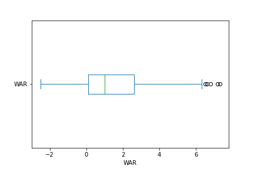
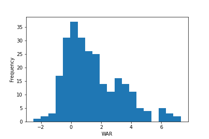

# :baseball: MLB Hard Hits to Player Value

For this project, my objective is to see if an MLB player hitting the ball hard makes them statistically more valuable. I will be comparing the correlation between Hard Hit Rate and Average Exit Velocity with Wins Above Replacement(WAR). 

I will also measure the correlation of more traditional baseball stats to WAR, compare them to the hard hit stats, and choose a highly correlated one to run a simple Linear Regression model to determine if it is a good predictor of WAR. 

To help complete this project I will be using the Python package Pandas as well as numpy, matplotlib, seaborn, and SKlearn

## Background

I was watching the New York Mets broadcast when they played a clip from an interview with 2B/OF Jeff McNeil where they discussed his strong start to the 2022 season. [Here is the clip](https://youtu.be/bdelnn9rQT8?t=52) 

In this interview Jeff credited a change in his approach at the plate to his early success. He states that over the last two seasons he was only trying to hit the ball hard, while this year he is simply "hitting it where they're not". 

This made me question: Is hitting the ball hard statistcally more valuable? What is the measureable relationship between hitting the ball hard and total player value? How does hitting the ball hard stack up when compared to more traditional baseball stats?

## The Categories

| Statistic                  | Description                                                                                   |
|:---------------------------|:----------------------------------------------------------------------------------------------|
| At Bats(AB)                |  Total At Bats a player recorded in the given season. At Bats are outcome dependent   |
| Runs(R)                    |  Total Runs scored in the given season                   |
| Home Runs(HR)              |  Total Home Runs a player hit in the given season                                     |
| Runs Batted In(RBI)        |  Total Runs a player drove in while at the plate |
| Batting Average(BA)        |  The number of hits a player records divided by his total at-bats|
| On Base Percentage(OBP)    |  The frequency that a batter reaches base per plate appearance|
| On Base Plus Slugging(OPS) |  Displays how well a hitter can reach base, hit for average, and power|
| Plate Appearances(PA)      |  Total turns a batter takes at the plate regardless of outcome |
| Exit Velocity(EV)          |  The average speed of the ball off the players bat|
| Hard Hit Rate(HardH%)      |  The frequency that a player bats a ball of 95mph or greater |
| Wins Above Replacement(WAR)|  Total player value when measured against a replacement level player |

To help further understand WAR here is the breakdown from Baseball Reference:
    
    WAR for position players has six components:

        ⋅⋅*Batting Runs
        ⋅⋅*Baserunning Runs
        ⋅⋅*Runs added or lost due to Grounding into Double Plays in DP situations
        ⋅⋅*Fielding Runs
        ⋅⋅*Positional Adjustment Runs
        ⋅⋅*Replacement level Runs (based on playing time)

    The first five measurements are all compared against league average, so a value of zero will equate to a league average player. Less than zero means worse than average, and greater than zero means better than average. These five correspond to the first half of our equation above (Player_runs - AvgPlayer_runs). The sixth factor is the second half of the equation (AvgPlayer_runs - ReplPlayer_runs).

If you would like a more complete explanation on how WAR is calculated you can check the source page [here](https://www.baseball-reference.com/about/war_explained_position.shtml)

## The Data

The data I will be using will be from the 2021 MLB season which I downloaded in CSV format from baseball-reference [here](https://www.baseball-reference.com/leagues/majors/2021-standard-batting.shtml). The data needed was taken from the standard batting, advanced batting, and value batting tables. These tables were then combined into one dataset. I then cleaned the dataset by removing unwanted columns, duplicates, and batters with less than 100 Plate Appearances. This took the dataset from 1167 batters to 258.

The data was split into a train and test dataset (70/30 split). WAR was dropped from the test data so that the model based on the train data could be applied to predict WAR.

## Exploratory Data Analysis

### Examining WAR Distribution

Baseball Reference has a key that claims the following levels of player value for WAR: 8+ MVP, 5+ All Star, 2+ Starting player, 0-2 Bench Player, <0 Replacement Level.

When examining the WAR distribution I found most of the data to be in the range of 0-2.6 WAR. This is unsurprising as the metric itself is a measurement of a player compared to replacement and league average players. 25% of the players in the dataset have a value above 2.6 WAR which would roughly fill out two All-Star teams and align with the Baseball Reference guidelines. Below are a box and whisker plot as well as a histogram which help visualize this data.

### Examining Hard Hit Rate and Exit Velocity Distribution

Taking a look at the hard hit statistics I found that most players have an average exit velocity between 86 and 90 mph. I also found that most players have a hard hit rate between 33% and 44%. 

While the average exit velocity numbers didn't jump out at me, I think the difference in hard hit rate amongst the top and bottom of this range is quite large when considering the amount of at bats they will take over a full season. Considering a full time player will put around 300+ balls into play in a season, that 11% difference could mean 30-40 more hard hit balls. Will the data show this results in more valuable players?

### Examining Correleations

After initial review, every measured category had a positive correlation with WAR while several categories had strong correlations. The categories Runs scored, OPS, RBI, and HR all had correlations of .7 or higher. As mentioned earlier, Runs scored and Runs Batted In are both components used when calculating WAR so the results involving those categories are not surprising.

EV and HardH% had the lowest correlation of any measured statistics with scores of .40 and .37 respectively. Exit Velocity and Hard Hit rate had the highest correlation when it came to Home Runs, but surprisingly, this measured at only .58 for EV and .57 for HardH%.

## Linear Regression Model

For my Linear Regression I chose to use OPS to try to predict WAR. I chose OPS because it has the second highest correlation with WAR and is not factored in to the calculation of WAR. The highest correlation, Runs scored, and third highest correlation, Runs Batted In, are both factored in when calculating WAR and only show a slight difference in correlation when compared to OPS. Over the past few seasons OPS has also become one of the main metrics used to measure a players offensive capabilities. OPS is prominently featured in every baseball broadcast and has also been displayed on the scoreboard in place of batting average at Mets home games I recently attended.

| Statistic                     | Result              |
|:---------------------------   |:--------------------|
| Coefficients                  |  12.68686626        |
| Mean Squared Error            |  1.63               |
| Coefficient of Determination  |  0.49               |

My results show that OPS by itself is a mediocre predictor of WAR with an R2 value of 0.49. Considering the correlation I found earlier was strong, but not incredibly strong (.9 or higher), this is not surprising. My Mean Squared Error of 1.63 seems relatively low which would make sense as most of the results were clustered around a similar area for both WAR and OPS. The Coefficient of 12.68 shows for every 1.000 increase in OPS the mean increase of WAR will be 12.68. As a baseball fan, I know this is not incredibly accurate as a handful of players will post an OPS in the 1.000 range every year while only a small number of players have ever posted a WAR as high as 12 in the history of the game. This could be a consquence of only using 1 year of data.

## Conclusions and Recommendations

- **Hard Hits** - There is a positive relationship between hitting the ball hard and WAR but it is measurably weaker than all other statistics used. Exit Velocity and Hard Hit Rate are, by themselves, not strong predictors of valuable baseball players. I would recommend baseball teams and broadcasts stop holding hard hit balls in such high regard and get back to "hitting it where they ain't"
- **OPS** - Despite having a strong correlation with WAR, OPS by itself is not a great predictor of WAR with an R2 of 0.49. None of the stats chosen would be a great predictor of WAR by themselves.
- **Future Analysis of WAR** - Having seen that no one stat is a great predictor of WAR, I would be interested in doing a Multiple Linear Regression Analysis to see if a combination of stats would perform better. While I wanted to keep this relatively simple, I would also be interested in performing a similar analysis with a larger data set to see if the results change. I can get the same data on Hard Hits dating back to 2015 and should be able to get traditional baseball stats dating back much farther.
- **Other Models** - Regression models may be too simple to predict WAR. Future research should test other supervised laerning models, e.g. Decision Tree.